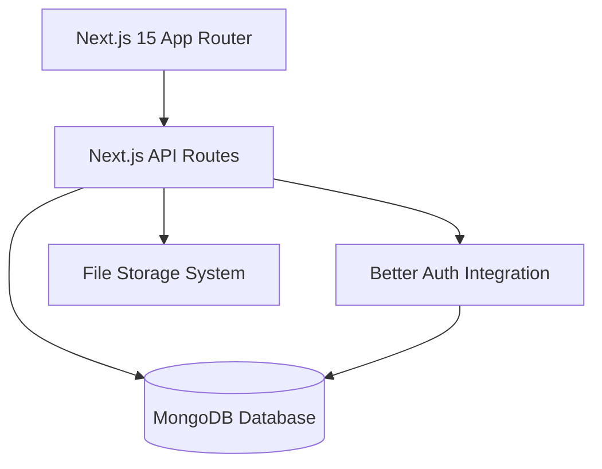
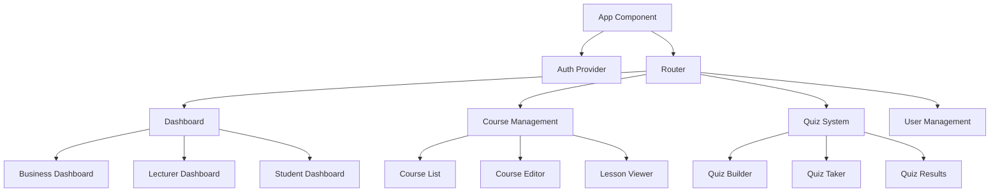

# LMS Platform Design Document

## Overview

The LMS platform will be built as a modern full-stack web application using Next.js 15 with the App Router, MongoDB for data persistence, and Better Auth for authentication. The system implements role-based access control with three primary user types: Business Owners, Lecturers, and Students. The unified Next.js architecture provides both frontend and backend capabilities in a single, cohesive application.

## Architecture

### High-Level Architecture



### Technology Stack

**Full-Stack Framework:**
- Next.js 15 with App Router
- TypeScript for type safety
- React 18+ with Server Components
- Tailwind CSS for styling
- React Hook Form for form management

**Backend/API:**
- Next.js API Routes (App Router)
- Better Auth for authentication
- Mongoose ODM for MongoDB operations
- Zod for request validation
- Multer for file upload handling

**Database:**
- MongoDB for primary data storage
- Better Auth session management

## Components and Interfaces

### Frontend Component Architecture



### API Endpoints Structure

**Authentication Routes:**
- `POST /auth/login` - User login
- `POST /auth/logout` - User logout
- `GET /auth/me` - Get current user
- `POST /auth/refresh` - Refresh token

**User Management Routes:**
- `GET /api/users` - List users (business owner only)
- `POST /api/users` - Create user (business owner only)
- `PUT /api/users/:id` - Update user
- `DELETE /api/users/:id` - Delete user (business owner only)

**Course Management Routes:**
- `GET /api/courses` - List courses
- `POST /api/courses` - Create course
- `GET /api/courses/:id` - Get course details
- `PUT /api/courses/:id` - Update course
- `DELETE /api/courses/:id` - Delete course
- `POST /api/courses/:id/lessons` - Add lesson to course
- `PUT /api/lessons/:id` - Update lesson
- `DELETE /api/lessons/:id` - Delete lesson

**Quiz Routes:**
- `GET /api/quizzes` - List quizzes
- `POST /api/quizzes` - Create quiz
- `GET /api/quizzes/:id` - Get quiz details
- `POST /api/quizzes/:id/submit` - Submit quiz answers
- `GET /api/quizzes/:id/results` - Get quiz results

## Data Models

### User Model
```typescript
interface User {
  id: string
  email: string
  name: string
  role: 'BUSINESS_OWNER' | 'LECTURER' | 'STUDENT'
  createdAt: Date
  updatedAt: Date
  profile?: UserProfile
}

interface UserProfile {
  id: string
  userId: string
  bio?: string
  avatar?: string
  phone?: string
}
```

### Course Model
```typescript
interface Course {
  id: string
  title: string
  description: string
  lecturerId: string
  isPublished: boolean
  createdAt: Date
  updatedAt: Date
  
  lecturer: User
  subCourses: SubCourse[]
  lessons: Lesson[]
  enrollments: Enrollment[]
  quizzes: Quiz[]
}

interface SubCourse {
  id: string
  title: string
  description: string
  courseId: string
  order: number
  
  course: Course
  lessons: Lesson[]
}

interface Lesson {
  id: string
  title: string
  content: string
  videoUrl?: string
  attachments: string[]
  courseId?: string
  subCourseId?: string
  order: number
  
  course?: Course
  subCourse?: SubCourse
}
```

### Quiz Model
```typescript
interface Quiz {
  id: string
  title: string
  description: string
  courseId: string
  timeLimit?: number
  attempts: number
  isPublished: boolean
  
  course: Course
  questions: Question[]
  submissions: QuizSubmission[]
}

interface Question {
  id: string
  quizId: string
  type: 'MULTIPLE_CHOICE' | 'TRUE_FALSE' | 'SHORT_ANSWER'
  question: string
  options?: string[]
  correctAnswer: string
  points: number
  order: number
}

interface QuizSubmission {
  id: string
  quizId: string
  studentId: string
  answers: QuizAnswer[]
  score: number
  submittedAt: Date
  
  quiz: Quiz
  student: User
}
```

### Enrollment Model
```typescript
interface Enrollment {
  id: string
  studentId: string
  courseId: string
  enrolledAt: Date
  progress: number
  completedAt?: Date
  
  student: User
  course: Course
}
```

## Error Handling

### Frontend Error Handling
- TanStack Query error boundaries for API failures
- Form validation errors with user-friendly messages
- Global error handler for unhandled exceptions
- Loading states and retry mechanisms

### Backend Error Handling
- Centralized error middleware
- Structured error responses with consistent format
- Input validation using Zod schemas
- Database constraint error handling
- File upload error handling

### Error Response Format
```typescript
interface ErrorResponse {
  success: false
  error: {
    code: string
    message: string
    details?: any
  }
}
```

## Testing Strategy

### Frontend Testing
- **Unit Tests:** Component testing with React Testing Library
- **Integration Tests:** API integration tests with MSW (Mock Service Worker)
- **E2E Tests:** Critical user flows with Playwright
- **Accessibility Tests:** Automated a11y testing

### Backend Testing
- **Unit Tests:** Individual function and middleware testing with Jest
- **Integration Tests:** API endpoint testing with supertest
- **Database Tests:** Repository pattern testing with test database
- **Authentication Tests:** Better Auth integration testing

### Test Coverage Goals
- Minimum 80% code coverage for critical business logic
- 100% coverage for authentication and authorization flows
- All API endpoints must have integration tests
- All user roles must have E2E test scenarios

## Security Considerations

### Authentication & Authorization
- Better Auth handles secure session management
- Role-based access control (RBAC) implementation
- JWT token validation for API requests
- Session timeout and refresh token rotation

### Data Protection
- Input sanitization and validation
- SQL injection prevention through Prisma ORM
- File upload restrictions and virus scanning
- HTTPS enforcement in production

### Privacy & Compliance
- User data encryption at rest
- Audit logging for sensitive operations
- GDPR compliance for user data handling
- Regular security dependency updates

## Performance Optimization

### Frontend Performance
- Code splitting by routes and features
- TanStack Query caching and background updates
- Image optimization and lazy loading
- Bundle size monitoring and optimization

### Backend Performance
- Database query optimization with proper indexing
- API response caching with Redis
- File upload streaming for large files
- Connection pooling for database connections

### Scalability Considerations
- Horizontal scaling capability for API servers
- CDN integration for static file delivery
- Database read replicas for query optimization
- Microservice architecture preparation for future growth