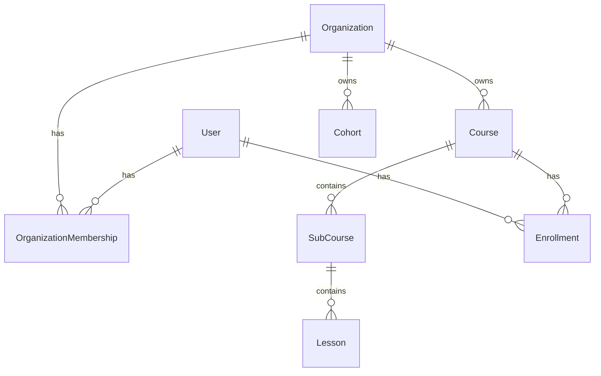

# Database Schema Reference

This document provides a detailed reference for the LMS Platform's data model. The source of truth is always `prisma/schema.prisma`.

## 🗺️ Entity-Relationship Overview

The database is designed around **Multi-Tenancy**. The `Organization` model is the root entity for all content and user relationships.



## 🏗️ Core Models

### Identity

#### `User`
The global user identity. A user exists once in the system but can belong to many organizations.
-   `role`: Global system role (`BUSINESS_OWNER`, `LECTURER`, `STUDENT`).
-   `isActive`: Global account status.

#### `Organization`
The tenant container.
-   `slug`: Unique identifier for URLs.
-   `plan`: Subscription tier (`FREE`, `PRO`, etc.).
-   `status`: Operational status (`ACTIVE`, `SUSPENDED`).

#### `OrganizationMembership`
The link between `User` and `Organization`.
-   `role`: Role within this specific organization (`OWNER`, `ADMIN`, `INSTRUCTOR`, `LEARNER`).
-   `organizationId`: Foreign key to Organization.
-   `userId`: Foreign key to User.

### Course Structure

#### `Course`
A learning unit.
-   `organizationId`: **CRITICAL**. Scopes the course to a tenant.
-   `lecturerId`: The primary author.
-   `level`: Difficulty (`BEGINNER`, `INTERMEDIATE`, `ADVANCED`).
-   `isPublished`: Visibility toggle.

#### `SubCourse` (Module)
A section within a course.
-   `courseId`: Parent course.
-   `order`: Sequencing index.

#### `Lesson`
The actual content.
-   `content`: Rich text content.
-   `videoUrl`: Link to video hosting.
-   `attachments`: Array of file URLs.

### Learning & Progress

#### `Enrollment`
A record of a user's access to a course.
-   `studentId`: The learner.
-   `courseId`: The course.
-   `cohortId`: (Optional) If part of a specific cohort.
-   `progress`: Calculated percentage (0-100).

#### `LessonProgress`
Granular tracking.
-   `enrollmentId`: Link to the student's enrollment.
-   `lessonId`: The specific lesson.
-   `isCompleted`: Status.
-   `timeSpent`: Time in seconds.

### Assessment

#### `Quiz`
An assessment attached to a course.
-   `passingScore`: Percentage required to pass.
-   `timeLimit`: Max duration in minutes.

#### `Question`
A single item in a quiz.
-   `type`: `MULTIPLE_CHOICE`, `TRUE_FALSE`, etc.
-   `options`: JSON array of choices.
-   `correctAnswer`: The valid answer key.

#### `QuizSubmission`
A student's attempt at a quiz.
-   `score`: The result.
-   `isPassed`: Derived from score vs passingScore.
-   `answers`: JSON blob of student responses.

## 🔐 Data Isolation Strategy

To ensure multi-tenant security, **every query for content must filter by `organizationId`**.

**❌ Bad (Data Leak):**
```typescript
// Returns courses from ALL organizations
const courses = await prisma.course.findMany();
```

**✅ Good (Isolated):**
```typescript
// Returns courses ONLY for the current organization
const courses = await prisma.course.findMany({
  where: {
    organizationId: session.user.organizationId
  }
});
```
